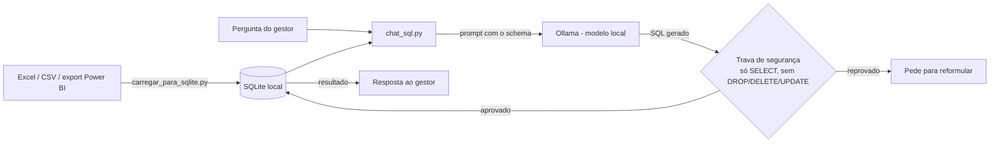

# Assistente de Relatórios (Chatbot local com Text-to-SQL)

Chat interno onde o gestor pergunta em português sobre os relatórios da empresa
(Excel, planilhas, exports do Power BI) e recebe respostas calculadas em cima
dos dados reais — **sem nenhum dado sair da máquina/servidor da empresa**.

> Este projeto **não usa nenhuma API externa de IA** (nada de OpenAI, Anthropic
> etc.). Todo o modelo de linguagem roda localmente via [Ollama](https://ollama.com).
> Isso foi uma decisão deliberada: a empresa não permite o uso de agentes de IA
> externos para esse tipo de dado.

## Por que "texto-para-SQL" e não RAG puro?

Testamos as duas abordagens (o histórico de decisão está em `ARQUITETURA.md`).
RAG (busca semântica) é ótimo para texto livre, mas ruim para perguntas
numéricas agregadas ("faturamento total de janeiro"), porque ele só enxerga
uma amostra de registros parecidos, não a tabela inteira. Por isso a
abordagem principal aqui é: **a LLM escreve uma consulta SQL, e quem calcula
o número é o banco de dados — nunca a IA.** Isso garante que os números
batem sempre, mesmo com um modelo local pequeno.

## Arquitetura



## Estrutura do projeto

| Arquivo | O que faz |
|---|---|
| `gerar_dados_teste.py` | Cria uma planilha fictícia para testar o pipeline sem depender de dados reais |
| `carregar_para_sqlite.py` | Lê os arquivos de `./relatorios/` (Excel/CSV) e monta o banco `relatorios.db` |
| `chat_sql.py` | Núcleo do assistente: monta o schema, chama o modelo local, valida e executa o SQL. Tem um `main()` para uso via terminal |
| `streamlit_app.py` | Interface de chat web (usa as funções de `chat_sql.py`, não duplica lógica) |
| `ingestao.py` / `chat_rag.py` | Versão experimental com RAG (busca semântica). Mantida para referência e para perguntas descritivas, mas **não confiável para números agregados** — ver limitações acima |
| `requirements.txt` | Dependências Python |

## Como rodar

```bash
# 1. Instalar dependências Python
pip install -r requirements.txt

# 2. Instalar o Ollama e baixar um modelo (uma vez só)
#    https://ollama.com
ollama pull qwen2.5-coder:3b

# 3. Colocar seus arquivos .xlsx / .csv em ./relatorios/
mkdir -p relatorios
cp /caminho/do/seu/relatorio.xlsx relatorios/

# 4. Carregar os dados no banco local
python carregar_para_sqlite.py

# 5a. Usar via terminal
python chat_sql.py

# 5b. OU usar a interface web
streamlit run streamlit_app.py
```

## Segurança e privacidade

- Nenhum dado é enviado para fora da máquina/rede da empresa: o Ollama roda
  localmente, e o SQLite é um arquivo local.
- `chat_sql.py` só aceita comandos `SELECT` e bloqueia palavras como `drop`,
  `delete`, `update`, `alter`. **Isso não é uma trava 100% à prova de tudo**
  (filtro de palavra pode ser burlado com truques) — é adequada para uso
  interno com gestor de confiança, mas não deveria ser exposta publicamente
  sem uma camada extra (ex.: usuário de banco só com permissão de leitura).
- `.gitignore` já está configurado para nunca versionar os dados reais
  (`relatorios/*.xlsx`, `relatorios.db`) nem o banco vetorial do RAG.

## Limitações conhecidas 

- **Precisão do SQL gerado ainda não foi validada com dados reais e perguntas
  reais do gestor.
- Modelos locais pequenos (3B) escrevem SQL simples bem, mas podem errar em
  perguntas com múltiplos filtros, `JOIN` entre tabelas, ou agregações
  aninhadas.
- Conexão direta com o Power BI (arquivo `.pbix` ou API do serviço) não está
  implementada — o fluxo atual espera que os dados já estejam exportados em
  Excel/CSV.

## Roadmap / próximos passos

1. Testar taxa de acerto do modelo com um conjunto de perguntas reais
   (ver `ESTUDO.md`, seção "Como montar seus próprios testes")
2. Se a taxa de acerto for baixa, testar um modelo maior (`qwen2.5-coder:7b`)
3. Automatizar a exportação de dados do Power BI para `./relatorios/`
4. Adicionar suporte a múltiplas tabelas relacionadas (`JOIN`)

